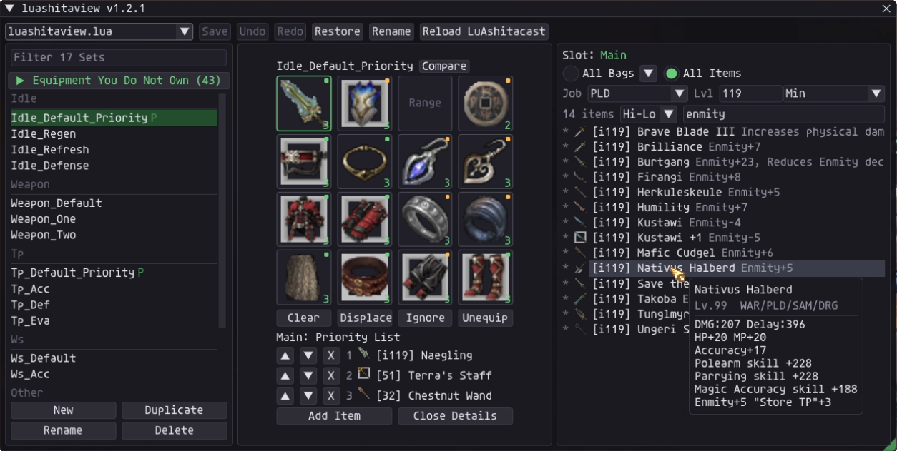

# luashitaview v1.2.1

View and edit your equipment sets in game, without touching a Lua file.

It works with LuAshitacast but is not affiliated with it or endorsed by it.

## Install

1. Drop the `luashitaview` folder into `Game/addons/`.
2. Type `/addon load luashitaview` in game.

Add it to your default script if you want it running every launch.

## Commands

`/lua`, `/gear`, `/sets` or `/luashitaview` to toggle the window.

`/sets debug` to log what the addon is doing, for reporting a problem.

## Profile styles

Standard LuAshitacast profiles are fully editable, as are gcinclude, Rag's, miniswap and BasicLuas. A few shapes open read only, like J-Cast, where the sets only exist while the file runs.

## Features

- An equipment grid with icons, so you never have to open the Lua file.
- Filters for job and level, set as a minimum or a maximum.
- Compare two sets side by side, duplicate a set, rename it or delete it.
- Finds what is broken in your profile and offers to fix it.
- Can upgrade some profiles to skip equipment you do not own and grow into it.
- Backs the file up before every save, probably more often than you need.

## Credits

Thanks to Thorny for [LuAshitacast](https://github.com/ThornyFFXI/LuAshitacast), which this addon exists to serve.

More addons @ https://github.com/AddonsXI
